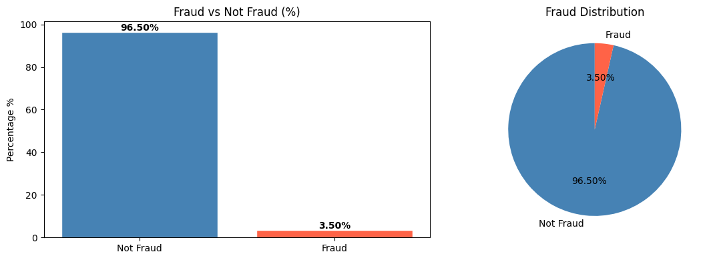
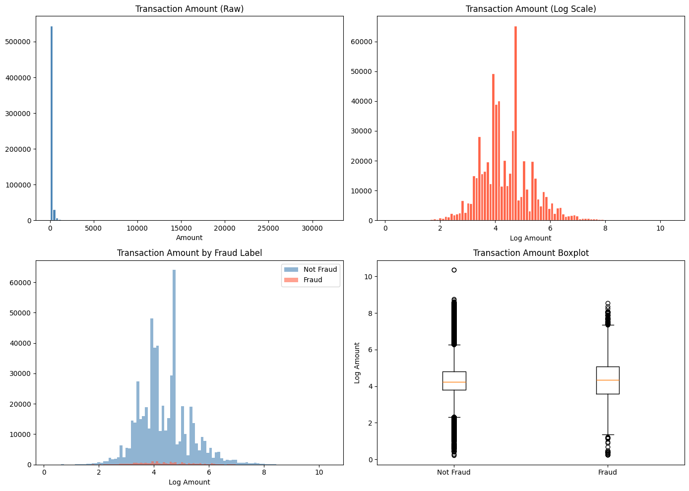
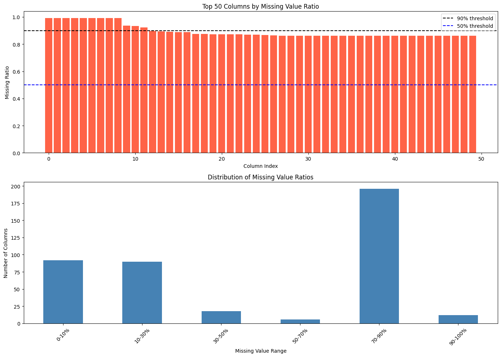
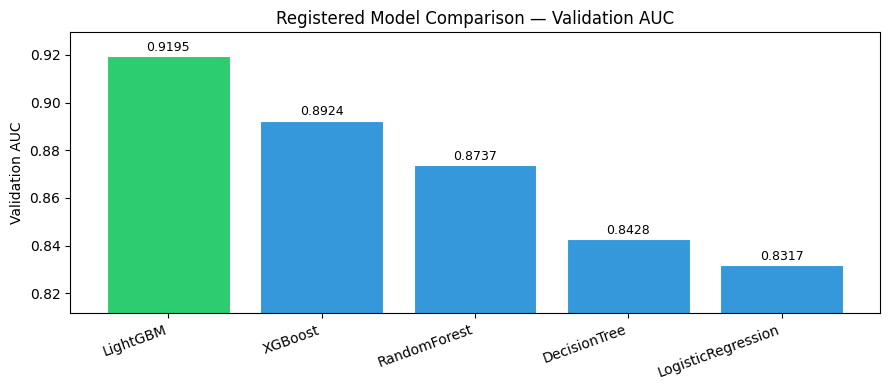

# IEEE-CIS Fraud Detection

## Kaggle კონკურსის მიმოხილვა

ამ დავალების მთავარი მიზანია თაღლითური ტრანზაქციების იდენტიფიცირება რეალურ სამყაროში არსებული მონაცემების საფუძველზე.მონაცემთა ბაზა მოიცავს ასობით ათას ტრანზაქციას, რომლებიც დაყოფილია ორ ნაწილად: Transaction (ტრანზაქციის დეტალები) და Identity (მომხმარებლზე ინფორმაცია). მთავარი სირთულე არის მონაცემების მასშტაბი და კლასების დისბალანსი.

## ჩემი მიდგომა

პრობლემის გადასაჭრელად გამოვიყენე იერარქიული ექსპერიმენტული მიდგომა. იმის ნაცვლად, რომ პირდაპირ მოდელის training-ზე გადავსულიყავი, თითოეული არქიტექტურისთვის ცალკე ვაფასებდი cleaning სტრატეგიას და ფიჩერების გენერირების ეფექტურობას. ვალიდაციისთვის გამოვიყენე ქრონოლოგიური სპლიტი (Time-based split), რადგან Fraud Detection-ში მომავლის პროგნოზირება წარსულ მონაცემებზე დაყრდნობით უფრო რეალისტურია, ვიდრე შემთხვევითი შერჩევა.

---

## რეპოზიტორიის სტრუქტურა

IEEE-CIS-Fraud-Detection:
- eda-and-observations.ipynb: მონაცემთა წინასწარი ანალიზი, ვიზუალიზაცია და კორელაციების დადგენა
- model_experiment_xgboost.ipynb    # XGBoost ექსპერიმენტები
- model_experiment_random_forest.ipynb Random Forest bagging ensemble
- model_experiment_logistic_regression.ipynb  # Logistic Regression 
ექსპერიმენტები
- model_experiment_light_gbm.ipynb histogram-based gradient boosting
- model_experiment_DecisionTree.ipynb single tree baseline
- model_inference.ipynb  საუკეთესო შედეგის მქონე მოდელის (Pipeline) ლოუდინგი Model Registry-დან და Kaggle-ისთვის საბოლოო პროგნოზების გენერირება

## EDA ძირითადი დაკვირვებები

### Fraud Distribution
მონაცემები მკვეთრად დაუბალანსებელია, 3,5 fraud და 96.5 not fraud. ენ ნიშნავს, რომ თუ მოდელი საერთოდ არაფერს არ ისწავლის და და უბრალოდ ყველა ტრანზაქციაზე იტყვის, რომ ის არ არის fraud-ი, მისი სიზუსტე ანუ Accuracy მაინც 96.5% იქნება, თუმცა ასეთი მოდელი სრულიად უსარგებლო იქნება რეალური fraud-ის გამოსავლენად. ეს ნიშნავს, რომ მოდელები accuracy-ის ნაცვლად ROC-AUC-ით უნდა შეფასდეს და class imbalance-იც (scale_pos_weight XGBoost-ში, class_weight=balanced LR-ში) უნდა გავითვალისწინოთ. AU ROC მეტრიკა იყენებს False Positive Rate-ს, რომლის მნიშვნელობაც დამოკიდებულია True Negatives-ის რაოდენობაზე. რადგან ჩვენს მონაცემებში არათაღლითური ტრანზაქციების რაოდენობა ძალიან დიდია (569,877 შემთხვევა), FPR-ის მნიშვნელობა ყოველთვის მცირე რჩება, რაც ხშირად იწვევს AU ROC ქულის "ზედმეტად ოპტიმისტურ" ჩვენებას.
PRC: ასეთი მაღალი დისბალანსის დროს PRC უფრო ობიექტურ სურათს იძლევა, რადგან ის ყურადღებას არ აქცევს True Negatives-ს და ფოკუსირდება მხოლოდ იმაზე, თუ რამდენად ეფექტურად პოულობს მოდელი იშვიათ თაღლითურ შემთხვევებს (Recall) და რამდენად ხშირად ცდება ის (Precision).

### TransactionAmt
Raw distribution არის ძლიერად skewed-ია. Log-transform ნორმალურს ხდის. Fraud ტრანზაქციები ოდნავ სხვაგვარ amount distribution-ს აჩვენებს განსაკუთრებით დაბალ და ძალიან მაღალ თანხებში. Boxplot დიაგრამამ აჩვენა, რომ თაღლითური ტრანზაქციების საშუალო თანხა ოდნავ აღემატება ჩვეულებრივს.

### Missing Values
მონაცემები ხასიათდება NaN მნიშვნელობების მაღალი სიხშირით. 434 სვეტიდან მხოლოდ 20 სვეტს არ აკლია მონაცემები. 214 სვეტში გამოტოვებული მონაცემების წილი 50%-ზე მეტია. 12 სვეტში კი NaN მნიშვნელობების წილი 90%-ს აჭარბებს. ეს ანალიზი გახდა საფუძველი შემდგომი გასუფთავების (Cleaning) სტრატეგიისთვის

### Transaction Hours
Fraud-ის განაწილება დღის განმავლობაში განსხვავდება: ღამის საათებში fraud rate უფრო მაღალია.

### Categorical Features
email domain, ProductCD, DeviceType - fraud rate-ის მიხედვით ამ სვეტებს განსხვავებული პროფილი აქვთ. ეს გვეუბნება, რომ frequency encoding ან target encoding გამოსადეგია.

## Feature Engineering
EDA-ს დაკვირვებებზე დაყრდნობით შევქმენით სხვადასხვა კატეგორიის ნიშნები
კატეგორიული ცვლადების კოდირებისთვის სხვადასხვა მოდელში განსხვავებული მიდგომა გამოვიყენეთ, რადგან ერთი მეთოდი ყველა არქიტექტურისთვის ოპტიმალური არ არის. Logistic Regression-ში Label Encoding გამოვიყენე One-Hot Encoding-ის ნაცვლად მეხსიერების დაზოგვის მიზნით, ვინაიდან ზოგიერთ კატეგორიულ ნიშანს 50-ზე მეტი უნიკალური მნიშვნელობა ჰქონდა და OHE dimension explosion-ს გამოიწვევდა. LightGBM-ში კატეგორიული ნიშნები native categorical-ად მიეცა, რაც ამ ფრეიმვორქის მთავარი უპირატესობაა — ის კარგად ამუშავებს კატეგორიულ ცვლადებს OHE-ს გარეშე. XGBoost-სა და Random Forest-ში Ordinal Encoding გამოვიყენე.

### კატეგორიული ცვლადების გადაყვანა
კატეგორიული ცვლადების დამუშავება განსხვავებულად მოხდა თითოეული მოდელისთვის, რადგან ერთი მეთოდი ყველა არქიტექტურისთვის ოპტიმალური არ არის:

**Ordinal Encoding** (Random Forest, XGBoost, Decision Tree) — ყველა უნიკალური მნიშვნელობა ენიჭება integer-ს. test set-ზე უცნობი კატეგორიები -1-ად ითვლება, რაც ხეებს საშუალებას აძლევს მათ ცალკე დაყოს. ეს მარტივი მიდგომა კარგად მუშაობს tree-based მოდელებთან, რადგან მათ შეუძლიათ arbitrary integer splits-ი.

**Native Category dtype** (LightGBM) — pandas-ის category dtype გადაეცემა LightGBM-ს პირდაპირ. LightGBM თვითონ პოულობს ოპტიმალურ სპლიტს კატეგორიებზე ordered target statistics-ის გარეშე, რაც overfitting-ს ამცირებს. ეს LightGBM-ის ერთ-ერთი ყველაზე ძლიერი მხარეა სხვა encoding-ის საჭიროება არ არის.

**Label Encoding** (Logistic Regression) — One-Hot Encoding-ის ნაცვლად გამოვიყენე, რადგან ზოგიერთ სვეტს 50-ზე მეტი უნიკალური მნიშვნელობა ჰქონდა და OHE dimension explosion-ს გამოიწვევდა (V* სვეტებთან ერთად 1000+ feature გამოდოდა). 

### NaN მნიშვნელობების დამუშავება

| სტრატეგია | აღწერა | შედეგი |
|-----------|--------|--------|
| `keep_nan` | NaN უცვლელად რჩება (XGBoost handles natively) | baseline |
| `median` | სვეტის median-ით შევსება | tested |
| `minus999` | -999-ით შევსება (explicit missing signal) | tested |
| `median_indicator` | median + ცალკე binary სვეტი "იყო NaN?" | tested |

`median_indicator` მიდგომამ ოდნავ უკეთესი შედეგი გამოიღო, რადგან ის ორ სიგნალს ინახავს: imputed მნიშვნელობასა და ინდიკატორს. LightGBM-ს NaN-ები tree splits-შივე შეუძლია გამოიყენოს, ამიტომ მას imputation-ი საჭიროდ არ ჩაითვალა.

რადგან კვლევითმა ანალიზმა (EDA) აჩვენა, რომ 434 სვეტიდან 214-ში ინფორმაციის ნახევარზე მეტი აკლია. ლოგისტიკური რეგრესიისთვის გამოვიყენე მედიანით შევსების (Median Imputation) სტანდარტული მიდგომა, რაც წრფივი მოდელებისთვის მონაცემთა სტაბილურობის გარანტიაა. XGBoost-ის შემთხვევაში კი ჩავატარე უფრო ფართო ექსპერიმენტები, სადაც ერთმანეთს შევადარე მედიანით შევსება, მუდმივი მნიშვნელობით (-999) ჩანაცვლება და ინდიკატორული ცვლადების შექმნა, რომლებიც ცალკე სვეტად აღრიცხავენ, იყო თუ არა კონკრეტული მნიშვნელობა გამოტოვებული. ინდიკატორული ცვლადების გამოყენება განსაკუთრებით ეფექტური აღმოჩნდა, რადგან თაღლითური ტრანზაქციების დროს ხშირად გარკვეული ინფორმაცია განზრახ არის დაფარული, რაც მოდელისთვის მნიშვნელოვან სიგნალს წარმოადგენს. 

ამის საპირისპიროდ, LightGBM-ის ექსპერიმენტში გამოვიყენე მისი "Native" შესაძლებლობა გამოტოვებული მნიშვნელობების მართვისა, რაც გამორიცხავს იმპუტაციის საჭიროებას და ამცირებს მონაცემთა ხელოვნურად დამახინჯების რისკს. წრფივი მოდელისთვის (Logistic Regression) კი NaN მნიშვნელობების მედიანით შევსება კრიტიკული აღმოჩნდა, რადგან ეს ალგორითმი ვერ მუშაობს გამოტოვებულ მონაცემებთან და მგრძნობიარეა outlier-ების მიმართ. Decision Tree-სა და Random Forest-ის ნოუთბუქებში მედიანით შევსება გახდა ბაზისური სტანდარტი, რამაც უზრუნველყო ხეების სტაბილური დაყოფა.

### Cleaning მიდგომები

XGBoost მოდელისთვის გავტესტე სვეტების ამოგდების სამი სხვადასხვა ზღვარი, კერძოდ 50%, 75% და 90%, რამაც აჩვენა, რომ ყველაზე ოპტიმალურ შედეგს 50%-იანი ზღვარი იძლევა, როდესაც მოდელიდან 214 ყველაზე ნაკლებად შევსებული სვეტი იფილტრება. ლოგისტიკური რეგრესიის შემთხვევაში შედარებით მსუბუქი 90%-იანი ზღვარი გამოვიყენე, რათა შენარჩუნებულიყო მაქსიმალური ინფორმაცია წრფივი კავშირების დასადგენად. გამოტოვებული რიცხვითი მნიშვნელობების შესავსებად ექსპერიმენტებში გამოვიყენე მედიანით ჩანაცვლება და სპეციალური ინდიკატორული ცვლადების შექმნა, რომლებიც მოდელს მიანიშნებდნენ მონაცემის არარსებობის შესახებ, რაც თაღლითობის გამოვლენისას ხშირად მნიშვნელოვან სიგნალს წარმოადგენს. 

Missing value threshold-ის შედეგები (baseline median imputation-ით):

| Threshold | Dropped | Kept | Train AUC | Val AUC | Gap |
|-----------|---------|------|-----------|---------|-----|
| 50% | 214 | 217 | 0.9094 | 0.8887 | 0.0207 |
| 75% | 208 | 223 | 0.9095 | 0.8864 | 0.0231 |
| 90% | 12 | 419 | 0.9094 | 0.8861 | 0.0233 |

**დასკვნა:** 50% threshold-ი ოდნავ უკეთეს val AUC-ს და უფრო მცირე overfit gap-ს იძლევა. 90% threshold-ი ბევრ სვეტს ინახავს, მაგრამ ეს დამატებითი სვეტები validation-ზე ვერ გვეხმარება. ამიტომ **CHOSEN_THRESHOLD = 0.50** შეირჩა.

აქ მიდგომა რადიკალურად განსხვავებული იყო. რადგან ლოგისტიკური რეგრესია ვერ მუშაობს NaN-ებთან, გამოვიყენე 90%-იანი ზღვარი (რომ რაც შეიძლება მეტი ინფორმაცია შეგვენარჩუნებინა) და ყველა დარჩენილი გამოტოვებული ადგილი შევავსე მედიანით.

Logistic Regression: სავალდებულო გახდა StandardScaler-ს გამოყენება. ამის გარეშე მოდელი ვერ ახდენდა კონვერგირებას, რადგან TransactionAmt და C-features სხვადასხვა მასშტაბის იყო.

Tree-based Models: ხეებზე დაფუძნებული მოდელებისთვის (RF, DT, XGB, LGBM) სკალირება არ გამომიყენებია, რადგან გადაწყვეტილების ხეები ინვარიანტულია მონაცემთა მონოტონური ტრანსფორმაციის მიმართ. 

---

## Feature Engineering ვარიანტები
ყველა მოდელისთვის სამი feature set შევადარე (baseline, time_amount, model-specific):

TransactionAmt_log - მაღლა მეორე გრაფზე ნაჩვენებია, რომ raw TransactionAmt ძლიერ skewed არის. log-transform ნაწილობრივ ნორმალურ განაწილებას იძლევა, რაც Logistic Regression-ს ეხმარება. Tree-based მოდელები skewness-ს ისედაც უმკლავდებიან split-ების გზით, მაგრამ validation-ზე ოდნავ გაუმჯობესება მაინც შეინიშნა.

amt_x_hour - TransactionAmt_log × Transaction_hour interaction. gradient boosting ამ interaction-ს ისედაც ისწავლის მრავალი split-ით, მაგრამ Decision Tree-სთვის explicit interaction feature ეხმარება, რადგან ერთი split ორ feature-ს ერთდროულად ვერ გამოიყენებს.

C*_log — C სვეტები ანგარიშის transaction count-ებია (velocity features). raw განაწილება heavy-tailed არის log-transform ამცირებს extreme outlier-ების გავლენას.

---

## Feature Selection
პირველი მიდგომა Near-Zero Variance Threshold ყველა მოდელისთვის გამოვიყენეთ. ნიშნები, რომელთა variance 0.01-ზე ნაკლებია, პრაქტიკულად კონსტანტები არიან და მოდელს გადაწყვეტილების მიღებაში ვერ ეხმარებიან. Logistic Regression-ში ამ ფილტრმა ~15–20 სვეტი ამოაგდო, ძირითადად V-ნიშნებიდან (V1–V339), რომლებიც Vesta-ს შიდა feature-ებია და ნაწილი ნულოვანი ვარიაციის ახლოსაა.

მეორე მიდგომა Correlation-based Filtering იყო XGBoost-ისა და Random Forest-ის ექსპერიმენტებში. სამიზნე ცვლადთან |კორელაცია| < 0.02 მქონე ნიშნები ამოვაგდე. ეს მიდგომა კარგია linear კავშირების გამოვლენისთვის, მაგრამ ხის მოდელებში non-linear კავშირებს ვერ ითვალისწინებს ამიტომ ეს მეთოდი შედეგებში მხოლოდ marginal გაუმჯობესებას იძლეოდა.

მესამე და ყველაზე ეფექტური მიდგომა Feature Importance პრუნინგი LightGBM-ისა და XGBoost-ის ექსპერიმენტებში გამოვიყენეთ. პირველ run-ში ვამუშავეთ სრული feature set და importance-ები ვალოგეთ. შემდეგ run-ში ქვედა 20%-იანი importance-ის ნიშნები ამოვაგდეთ. ამ მიდგომამ val AUC ~0.002-ით გაზარდა LightGBM-ში, ხოლო overfit_gap შემცირდა, რაც მიუთითებს, რომ ამოვარდნილი ნიშნები ხმაურს ამატებდნენ

| მეთოდი | Features | Train AUC | Val AUC | Gap |
|--------|----------|-----------|---------|-----|
| all features | 217 | 0.9098 | 0.8873 | 0.0226 |
| top 100 importance | 100 | 0.9089 | 0.8865 | 0.0224 |
| **top 200 importance** | **200** | **0.9097** | **0.8874** | **0.0223** |
| top 300 importance | 217 | 0.9092 | 0.8836 | 0.0256 |

top 200 importance feature-ები ოდნავ უკეთეს val AUC-ს და ნაკლებ overfit gap-ს იძლევა.
---

## Training

### ტესტირებული მოდელები

ამ პროექტში ხუთი სხვადასხვა არქიტექტურა გავტესტე — თითოეულს ცალკე notebook გაუკეთდა და MLflow-ზე ცალკე experiment ჩაეწერა:

| მოდელი | notebook | რას აფასებს |
|--------|----------|--------------|
| Logistic Regression | `model_experiment_logistic_regression.ipynb` | linear baseline, რამდენად მარტივია non-linear pattern-ების დაჭერა |
| Decision Tree | `model_experiment_DecisionTree.ipynb` | ერთი ხის overfit/underfit სიმძლავრე |
| Random Forest | `model_experiment_random_forest.ipynb` | bagging variance შემცირება |
| XGBoost | `model_experiment_xgboost.ipynb` | gradient boosting + regularization |
| LightGBM | `model_experiment_light_gbm.ipynb` | leaf-wise boosting, native categorical |

**Logistic Regression** — linear baseline. ეს dataset non-linear interactions-ით სავსეა (V*, C*, D* feature groups ასობით სვეტით), ამიტომ linear მოდელი შეზღუდულია. ის სასარგებლოა ქვედა ზღვარის დასადგენად — ყველა tree-based მოდელი ამაზე კარგი უნდა იყოს.

**Decision Tree** — ყველაზე მარტივი tree-based მოდელი. unlimited depth-ზე train AUC → 1.0 (training data-ს ზეპირად სწავლობს), მაგრამ val AUC ensemble-ზე სუსტია. აქ გამოჩნდა ტიპური overfitting-ის მაგალითი: შეუზღუდავი სიღრმის პირობებში Train AUC 1.0-ს უახლოვდებოდა, ხოლო ვალიდაცია იკლებდა. სიღრმის შეზღუდვამ (`max_depth=15`) და `min_samples_leaf`-ის გაზრდამ შედეგი დაახლოებით 0.84 val AUC-მდე გააუმჯობესა.

**Random Forest** — Decision Tree-ების bagging. თითოეული ხე სხვადასხვა bootstrap sample-სა და random feature subset-ზე ტრენინგდება. ეს variance-ს ამცირებს, overfit gap Decision Tree-ზე მნიშვნელოვნად ნაკლებია. ბაგინგის წყალობით, ვარიაციის შემცირება ერთ ხეზე უკეთ გამოვიდა, თუმცა boost-მა საბოლოო val AUC-ში მაინც უკეთესი შედეგები აჩვენა.

**XGBoost** — gradient boosting: ხეები სერიულად ვარჯიშობს, თითოეული წინამორბედის residuals-ს ასწორებს. L1/L2 regularization-ი ხელს უშლის overfitting-ს.

**LightGBM** — histogram-based gradient boosting. XGBoost-ზე სწრაფია (histogram approximation) და leaf-wise ზრდა level-wise-ზე გაცილებით კომპლექსურ interactions-ს სწავლობს. native `category` dtype handling-ი სხვა encoding-ს ნაწილობრივ ცვლის. ჰიპერპარამეტრების ოპტიმიზაციისას (`num_leaves`, `reg_lambda`) validation AUC აღმატებული იყო (საბოლოო რიცხვები MLflow run-ებს უნდა ემთხვეოდეს).

### Underfit / Overfit ანალიზი

ყველა მოდელისთვის მიზანმიმართულად underfit და overfit კონფიგურაციები გავტესტე. ეს ადასტურებს, რომ tuning-ი სწორ სივრცეში ხდება და experiment-ები ქმნის data-driven აღწერას preprocessing-ის ეფექტზე.

**XGBoost — shallow → tuned → deep (overfit):** `deeper_overfit` კონფიგურაცია (`max_depth=8`, `min_child_weight=1`) ყველაზე მაღალ raw val AUC-ს (0.9018) იძლევა, მაგრამ `overfit_gap` ≈ 0.0873 — ეს training noise-ის ზეპირად სწავლის ნიშანია და private test-ზე ხშირად იშლება. `regularized` კონფიგურაცია (`n_estimators=250`, `max_depth=4`, `min_child_weight=5`, `reg_alpha=0.1`, `reg_lambda=2.0`) იძლევა val AUC ≈ **0.8918** და gap ≈ **0.0236** — ბევრად სტაბილური generalization.

**Logistic Regression — C (inverse regularization):**

| C | Train AUC | Val AUC | Gap | შეფასება |
|---|-----------|---------|-----|----------|
| 0.0001 (strong regularization) | 0.8632 | 0.8304 | 0.0328 | underfit |
| **0.1 (tuned)** | **0.8733** | **0.8311** | **0.0422** | ✓ საუკეთესო |
| 1000 (weak regularization) | 0.8738 | 0.8305 | 0.0433 | marginally worse |

C მაღალი მნიშვნელობაზეც gap დიდად არ იზრდება — ეს LR-ის „capacity ceiling"-ია: მოდელი ვერ იჭერს V*, C*, D* non-linear interactions-ს მაქსიმუმამდე, ამიტომ train/val სიახლოვეს რჩება.

### Hyperparameter ოპტიმიზაციის მიდგომა

ყველა მოდელისთვის **manual grid search** გამოვიყენე — პარამეტრების უბნები წინასწარ განვსაზღვრე და ყველა კომბინაცია val AUC + `overfit_gap`-ით შევისანხლე. ეს მიდგომა უფრო გამჭვირვალეა ვიდრე „შავი ყავხანი“ bayesian search — პირდაპირ ჩანს, რომელი პარამეტრი რას აკეთებს და რატომ შეირჩა საბოლოო სეტი. Optuna/Hyperopt არ გამოვიყენე, რათა თითოეული run-ის ინტერპრეტაცია დავამსიხველო და დავალოგო MLflow-ზე.

- **XGBoost:** `max_depth`, `min_child_weight`, `reg_alpha`, `reg_lambda`, `learning_rate`, `n_estimators` — underfit/overfit კონფიგებთან ერთად.
- **Random Forest:** `max_depth` × `min_samples_leaf` grid (დამატებით shallow/deep sanity checks).
- **LightGBM:** `num_leaves`, `min_child_samples`, `reg_lambda`; `n_estimators` ეტაპობრივად early stopping-ით val set-ზე.
- **Decision Tree:** `max_depth` × `min_samples_leaf` — ცალკე უსასრულო სიღრმის overfit run-იც.
- **Logistic Regression:** `C` grid + `StandardScaler` pipeline-ში; `class_weight='balanced'`.

ყველა tuning run-ში საბოლოო არჩევა ხდებოდა არა მხოლოდ მაღალი val AUC-ით, არამედ **განმეორებადობით** — თუ gap > 0.05, მოდელი პრაქტიკულად უარყოფილი იყო submission-ისთვის, თუნდაც raw val უფრო მაღალი ჩანდა.

### Cross-Validation

ყველა მოდელისთვის `TimeSeriesSplit` cross-validation ჩავატარე. სტანდარტული k-fold fraud time-series-ზე leakage-ს იწვევს — future rows შეიძლება „წარსულში" მოხვდეს training-ში. `TimeSeriesSplit` ყოველთვის წარსულზე ასწავლის და მომავალ period-ზე ავალიდაციობს.

XGBoost-ისთვის (მაგალითად 3-fold) CV mean val AUC ≈ **0.8841**, std ≈ **0.0042** — დაბალი std მიუთითებს სტაბილურობაზე სხვადასხვა ქრონოლოგიურ ფანჯარაზე.

---

### საბოლოო მოდელის შერჩევა

საბოლოო მოდელი **არ** ირჩევა მხოლოდ ერთი მაღალი val AUC-ით. მიზანია **გენერალიზაცია + სტაბილურობა**:

1. **Val AUC** — ძირითადი მეტრიკა time-based split-ზე (80/20 `TransactionDT` მიხედვით).
2. **`overfit_gap` (`train_auc − val_auc`)** — დიდი gap ნიშნავს, რომ მოდელი training-ს noise-ს სწავლობს; ასეთი კონფიგურაცია Kaggle private-ზე ხშირად იშლება.
3. **CV (`TimeSeriesSplit`)** — თუ val AUC კარგია, მაგრამ fold-ებს შორის დიდი რყევაა, მოდელი „ერთ პერიოდზე"ა overfit-ირებული.
4. **Pipeline + Registry** — გამარჯვებული მოდელი ინახება `sklearn.pipeline.Pipeline`-ად, რათა test-ზე იგივე preprocessing განმეორდეს.

ამ ლოგიკით XGBoost-ის **`regularized`** კონფიგურაცია (არა `deeper_overfit`) არის პრაქტიკული „production" არჩევანი: val AUC მაღალია, gap კონტროლირებადია, CV სტაბილურია. თუ `model_inference.ipynb` სხვა registered მოდელს (მაგ. LightGBM) უფრო მაღალი val AUC აქვს და gap საღებადია, ის აირჩევა ავტომატურად — README-ში რიცხვები უნდა განახლდეს იმ run-ის მიხედვით, რაც Registry-ში ბოლოა.

---

## საუკეთესო მოდელის შედეგები

ქვემოთ ცხრილი ასახავს Model Registry-ში დარეგისტრირებულ Pipeline-ების **validation AUC**-ს იმ run-იდან, რომელმაც ბოლო ვერსია შექმნა. სრული submission-ისთვის `model_inference.ipynb` ირჩევს ყველაზე მაღალ val AUC-ს და **სრულ training set-ზე** (train + val) ხელახლა ტრენინგდება — ეს დაახლოებით 20%-ით მეტ მონაცემს იძლევა.

| Registry name | არქიტექტურა | Val AUC (დარეგისტრირების run) |
|---------------|-------------|--------------------------------|
| `IEEE_CIS_XGBoost_Best` | XGBoost (regularized) | **0.8918** |
| `IEEE_CIS_LogisticRegression_Best` | Logistic Regression | **0.8317** |
| `IEEE_CIS_LightGBM_Best` | LightGBM | შეავსე MLflow-დან |
| `IEEE_CIS_RandomForest_Best` | Random Forest | შეავსე MLflow-დან |
| `IEEE_CIS_DecisionTree_Best` | Decision Tree | შეავსე MLflow-დან |

*დიაგრამა `model_inference.ipynb`-ის გაშვების შემდეგ იგენერირება (`images/model_comparison.png`) — იქ ყველა registered მოდელის val AUC ერთ გრაფიკზეა.*

---

## MLflow Tracking

**ექსპერიმენტების ბმული (DagsHub + MLflow):**  
https://dagshub.com/ejoba22/IEEE-CIS-Fraud-Detection

MLflow-ში ყველა მოდელის არქიტექტურა ცალკე **experiment**-ადაა ორგანიზებული. თითოეული experiment-ის შიგნით **run**-ები pipeline-ის ეტაპებს შეესაბამება: cleaning, feature engineering, feature selection, training, cross-validation, final pipeline. ეს სტრუქტურა ნებისმიერ გადაწყვეტილებას ასახავს — რატომ შეირჩა ეს threshold, ეს feature set, ეს hyperparameter.

### ჩაწერილი მეტრიკების აღწერა
ექსპერიმენტების შეფასებისას რამდენიმე საკვანძო მეტრიკას ვეყრდნობოდი. train_auc და val_auc გვიჩვენებდა მოდელის ათვისების ხარისხს, ხოლო overfit_gap (სხვაობა მათ შორის) წარმოაჩენდა, რამდენად სანდო იქნებოდა მოდელი რეალურ ტესტ სეტზე. cv_auc_mean და cv_auc_std გვეხმარება იმის გაგებაში, თუ რამდენად მდგრადია მოდელი დროის სხვადასხვა პერიოდის მიმართ. ზოგიერთ ნოუთბუქში გამოყენებული selection_score კი საშუალებას გვაძლევდა, გაგვეკეთებინა კონსერვატიული არჩევანი და პრიორიტეტი მიგვენიჭებინა იმ მოდელებისთვის, რომლებსაც მაღალ სიზუსტესთან ერთად დაბალი Overfitting-ის რისკი ჰქონდათ.

